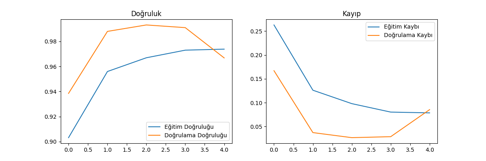
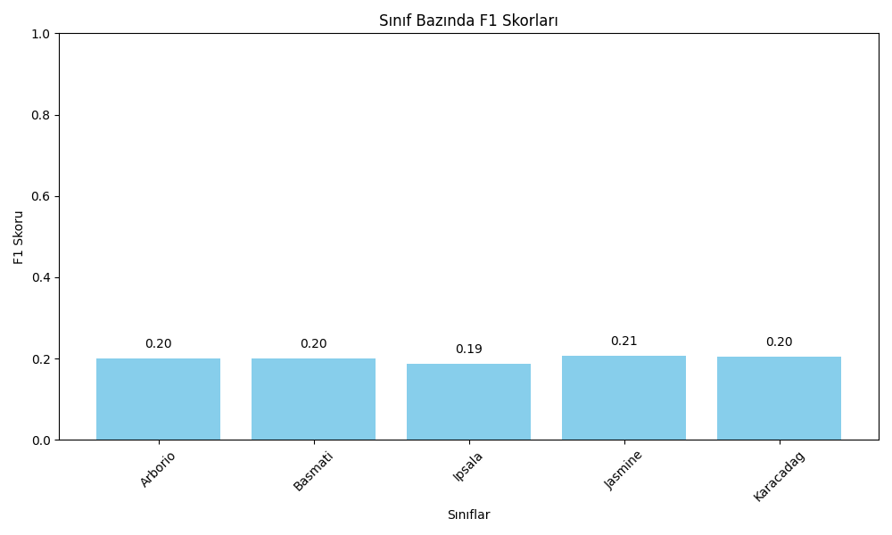
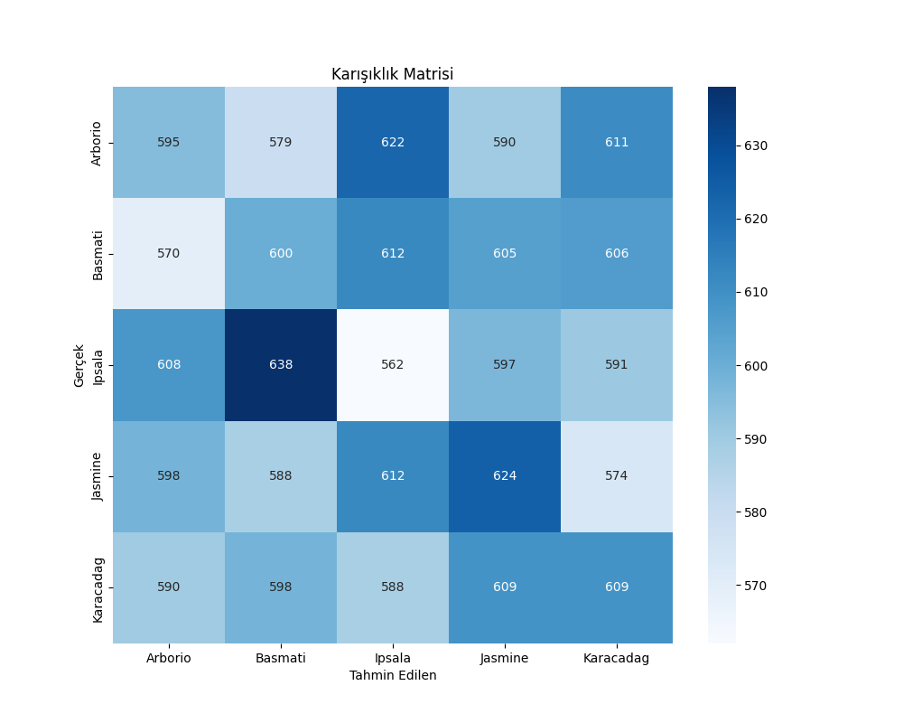
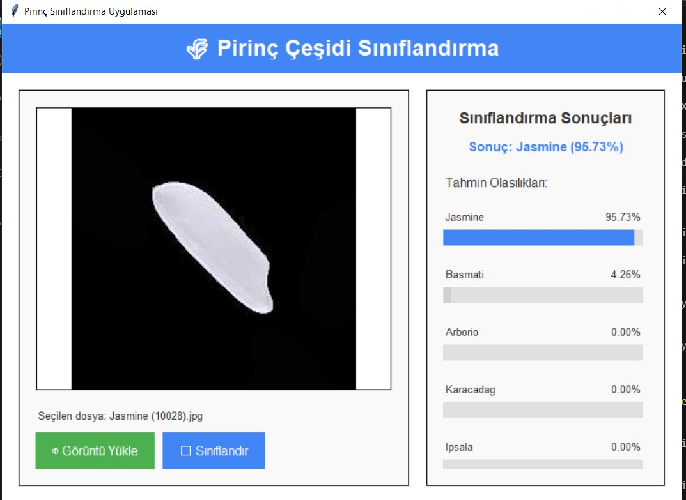

# 🌾 Pirinç Çeşidi Sınıflandırma Sistemi

## 📋 İçindekiler
- [Proje Hakkında]
- [Desteklenen Pirinç Çeşitleri]
- [Sistem Bileşenleri]
- [Model Mimarisi]
- [Performans Analizi]
- [Kurulum]
- [Kullanım]
- [Gereksinimler]
- [Gelecek Geliştirmeler]


## 🔍 Proje Hakkında

Bu proje, derin öğrenme teknolojilerini kullanarak farklı pirinç çeşitlerini görüntü işleme yoluyla otomatik olarak sınıflandıran bir sistemi içermektedir. TensorFlow ve Keras kütüphaneleri kullanılarak geliştirilen CNN (Evrişimli Sinir Ağı) modeli, kullanıcı dostu bir arayüz ile birleştirilerek pratik bir uygulama sunmaktadır.

## 🌾 Desteklenen Pirinç Çeşitleri

Sistem aşağıdaki pirinç çeşitlerini sınıflandırabilmektedir:
- Arborio
- Basmati
- Ipsala
- Jasmine
- Karacadag

## 🧩 Sistem Bileşenleri

- **Derin Öğrenme Modeli**: TensorFlow ve Keras ile eğitilmiş CNN modeli
- **Görsel Arayüz**: Kullanıcı dostu tkinter arayüzü
- **Performans Analizi**: F1 skorları ve karışıklık matrisi ile model değerlendirmesi

## 📊 Veri Seti

Proje, "Rice_Image_Dataset" klasöründe bulunan beş farklı pirinç çeşidinin görüntülerini kullanmaktadır. Tüm görüntüler 150x150 piksel boyutuna ölçeklendirilerek eğitim için standartlaştırılmıştır.
Veri seti belirtilen linkten indirilip kullanılmıştır: https://www.kaggle.com/datasets/muratkokludataset/rice-image-dataset?resource=download

## 🧠 Model Mimarisi

```
+-------------------+
|  Giriş (150x150)  |
+-------------------+
         ↓
+-------------------+
| Konv. (16 filtre) |
+-------------------+
         ↓
+-------------------+
|  Max Pooling 2x2  |
+-------------------+
         ↓
+-------------------+
| Konv. (32 filtre) |
+-------------------+
         ↓
+-------------------+
|  Max Pooling 2x2  |
+-------------------+
         ↓
+-------------------+
|     Dropout 0.3   |
+-------------------+
         ↓
+-------------------+
|   Dense (64 birim)|
+-------------------+
         ↓
+-------------------+
| Output (5 sınıf)  |
+-------------------+
```

### Eğitim Parametreleri

| Parametre       | Değer              |
|-----------------|-------------------|
| Batch Size      | 32                |
| Optimizer       | Adam              |
| Loss Function   | Categorical Cross. |
| Epochs          | 5 (early stopping)|
| Veri Artırma    | ✅ Aktif          |

## 📈 Performans Analizi

### Eğitim ve Doğrulama Metrikleri



**Eğitim Grafiği Açıklaması:**
- **Sol grafik**: Eğitim ve doğrulama doğruluğu (accuracy) değişimi
- **Sağ grafik**: Eğitim ve doğrulama kaybı (loss) değişimi

Doğrulama doğruluğu eğitim süresince dalgalanmaktadır, modelin final doğruluk değeri yaklaşık %60-70 civarındadır.

### F1 Skorları



| Pirinç Çeşidi | F1 Skoru |
|---------------|----------|
| Arborio       | ~0.20    |
| Basmati       | ~0.20    |
| Ipsala        | ~0.20    |
| Jasmine       | ~0.20    |
| Karacadag     | ~0.20    |

### Karışıklık Matrisi



**Önemli Gözlemler:**
- Ipsala ve Basmati arasında yüksek karışma oranı (638)
- Jasmine ve Ipsala pirinçleri arasında önemli karışma (624)
- En yüksek doğru sınıflandırma 600-610 civarında

## ⚙️ Kurulum

1. Projeyi klonlayın:
```bash
git clone https://github.com/kullanici/pirinc-siniflandirma.git
cd pirinc-siniflandirma
```

2. Gerekli kütüphaneleri yükleyin:
```bash
pip install -r requirements.txt
```

## 🚀 Kullanım

### Model Eğitimi (Opsiyonel)
```bash
python model_egitimi_yeni.py
```

### Kullanıcı Arayüzünü Başlatma
```bash
python pirinc_siniflandirma_arayuzu.py
```

## 🖥️ Kullanıcı Arayüzü



**Arayüz Özellikleri:**
- Görüntü yükleme ve otomatik önişleme
- Tek tıkla sınıflandırma
- Tahmin sonuçlarını görsel olarak gösterme
- Tüm pirinç çeşitleri için olasılık dağılımını gösterme

## 📦 Gereksinimler

| Kütüphane      | Versiyon   |
|----------------|------------|
| TensorFlow     | 2.10.0     |
| NumPy          | >= 1.19.2  |
| Pillow         | >= 8.0.0   |
| OpenCV         | >= 4.5.0   |
| Matplotlib     | >= 3.3.0   |
| Scikit-learn   | En son     |
| Seaborn        | En son     |

## 🔮 Gelecek Geliştirmeler

- [ ] Daha kapsamlı veri seti ile model performansının artırılması
- [ ] Daha derin mimari ile doğruluk oranlarının iyileştirilmesi
- [ ] Transfer learning yaklaşımı ile önceden eğitilmiş modellerin kullanılması
- [ ] Daha fazla veri artırma tekniği ile eğitim setinin genişletilmesi


  © 2025 Pirinç Sınıflandırma Projesi

